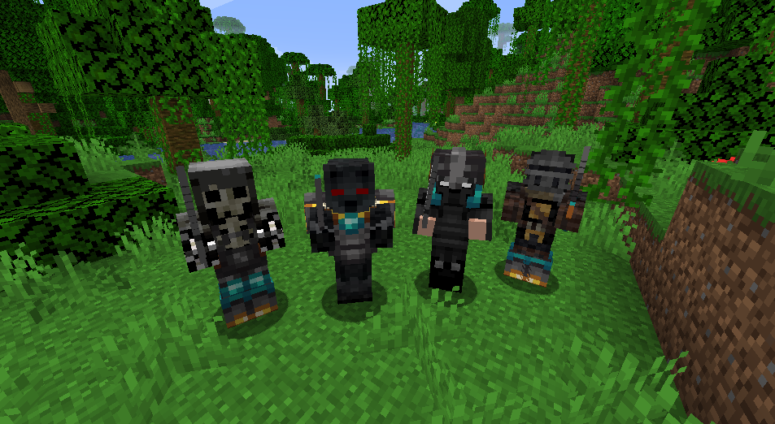
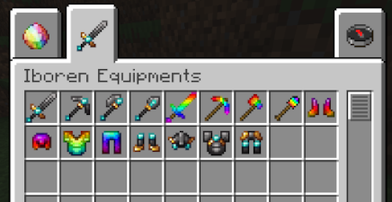
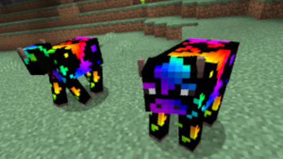

# Iboren Mod

Welcome to the Iboren Minecraft Mod repository! This mod adds new items and blocks to the Minecraft world, including custom ore and other fun features.

## Features

- **New Textures:** Ibo and Ren Ores
- **New Armours:** Ren/Ibo
- **New Recipes** Ren/Ibo Armours
- **New Entity** Ren Zombie + Custom Loots

- Custom Item Group for better organization in the creative inventory

## Getting Started

To use the Iboren Mod in your Minecraft game:

1. Download the `iborenMod-2.7jar` file from the [releases section](#).
2. Place it in your `mods/` folder within your Minecraft directory.
3. Launch Minecraft using the Forge profile that matches the mod's version (1.16.5).

## Installation

### Requirements:
- Minecraft 1.16.5
- Minecraft Forge 36.2.34 (or matching version)
  
### Steps:
1. Install Minecraft Forge (if not already installed).
2. Copy the `iborenMod-2.7.jar` to your `mods/` folder.
3. Launch Minecraft!

## How to Build

1. Clone this repository.
2. Open the project in your IDE (IntelliJ IDEA, Eclipse, etc.).
3. Run `./gradlew build` to build the mod.

## Contributing

If you'd like to contribute to this mod, feel free to fork this repository, create a branch, and submit a pull request.

## License

This mod is licensed under the MIT License. See the `LICENSE` file for more information.

